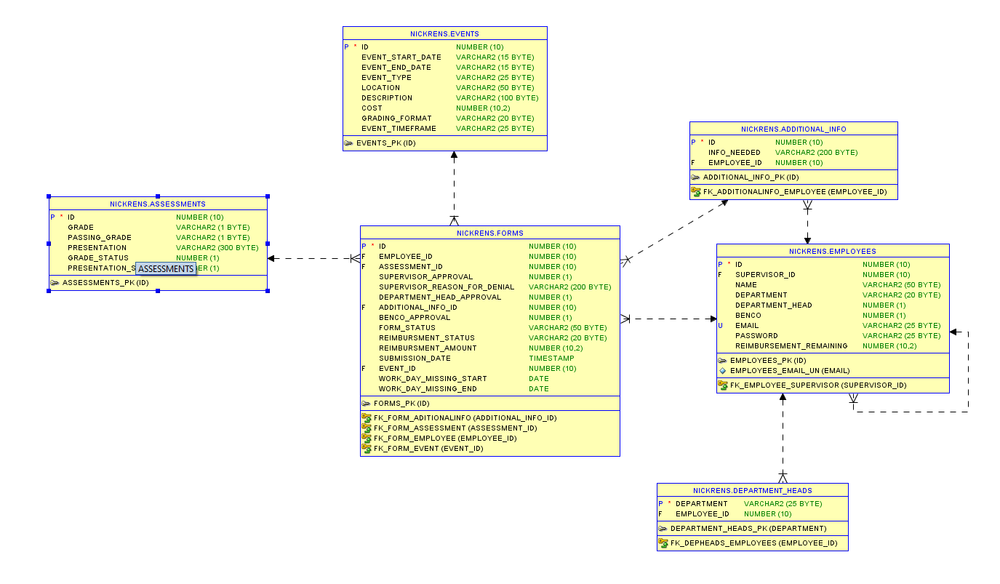

# Project1TRMS

## Project Description
The purpose of TRMS is to provide a system that encourages quality knowledge growth relevant to an individual’s expertise.   Currently, TRMS provides reimbursements for university courses, seminars, certification preparation classes, certifications, and technical training.  The previous system relied solely on email communication, requiring manual lookups of available funds and was error-prone due to inbox clutter and incorrect routing of tasks.

## Technologies Used
* Java
* Servlets
* JDBC
* SQL
* JavaScript
* HTML
* CSS

## Features
The Tuition Reimbursement System, TRMS, allows users to submit reimbursements for courses and training. The submitted reimbursement must be approved by that employee's supervisor, department head, and benefits coordinator. The benefits coordinator then reviews the grade received before finalizing the reimbursement.

## Getting Started
git clone https://github.com/nickrens/Project1TRMS.git

create a db to match this ERD

create a connection.properties file with these fields:
* url
* ursername
* password

fill out with your database credentials

populate the Employees table with needed employess
Run project on a server of your choice
